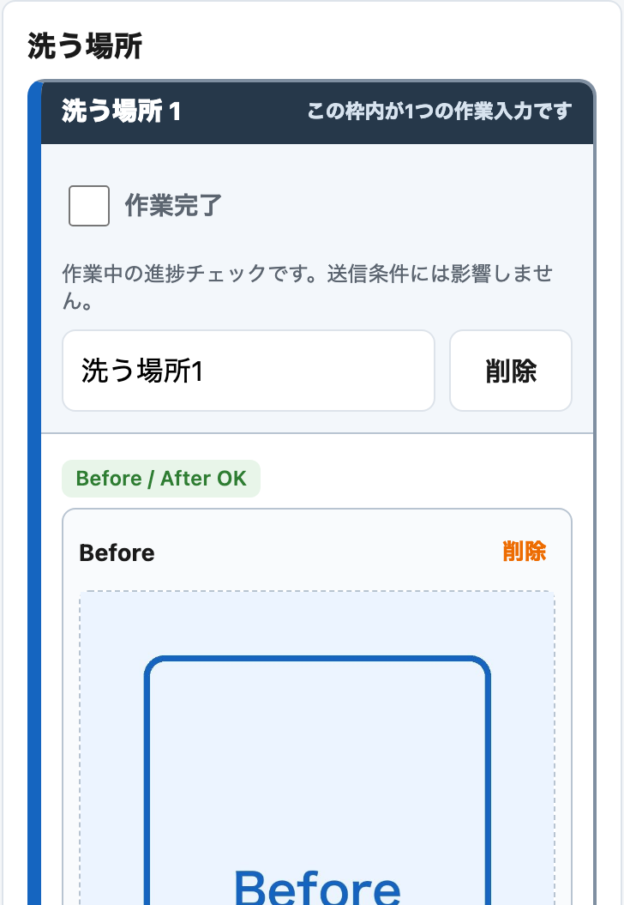
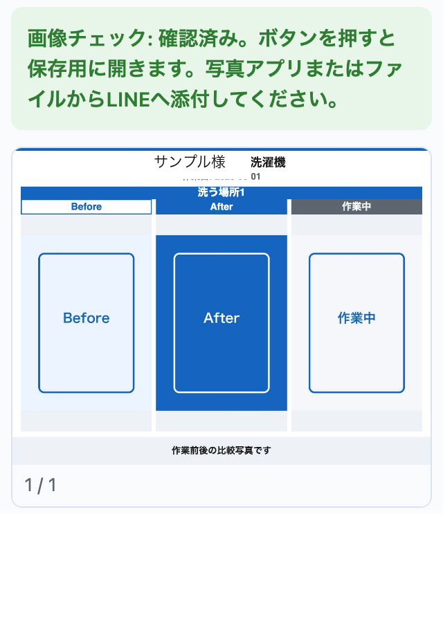

# 作業写真アプリ

訪問先の作業写真が混ざることと、写真の送り忘れを防ぐための小さなWebアプリです。
お客様ごと・洗う場所ごとに作業前後の写真を並べ、人が画像を確認してから手動で送ります。

## 画面

次の画像は、名前と写真を見本にした説明用の画面です。旧版の画面例のため、現在のボタン名や表示と一部異なります。実際のお客様の写真ではありません。

### 作業前後の写真を登録する



### 送る前に画像を確認する



## 使い方

1. 「お客様を追加して始める」を押します。最初はお客様データが空です。
2. お客様名、作業内容、作業日を入力します。試すときの名前は「サンプル」にしてください。
3. 洗う場所ごとにビフォーとアフターの写真を登録し、「送る写真の確認が終わった」を押します。
4. お礼文を確認し、「画像チェック」で送付用画像を表示します。確認後に内容を変更した場合は、もう一度チェックします。
5. 対応端末では「一括画像を共有」で端末の共有画面を開き、利用者が送付先を選んで送ります。
6. 直接共有できない場合は、表示された保存ボタンで画像を保存するか、プレビューのスクリーンショットをLINEへ手動で添付します。
7. 実際に送った後だけ、送信済みのチェックを入れて「LINE送信済みにして保存」を押します。共有画面を開くだけでは送信済みになりません。

「今日 LINE で送る」には、写真を確認済みで、まだ送信済みになっておらず、作業日または送信予定日が今日以前のお客様が出ます。
写真のない場所などは画像チェックの表示を読み、必要な写真がそろっているか人が判断してください。

## 手元で試す方法

Python 3が使える環境で、このREADMEがあるフォルダをターミナルで開き、次を実行します。

```sh
python3 -m http.server 8765 --bind 127.0.0.1
```

ブラウザで `http://127.0.0.1:8765/` を開きます。終了するときはサーバーを起動したターミナルでControl+Cを押します。
HTMLファイルを直接開く方法では、データの読み込みや保存が動かない場合があります。
写真の見本には、このフォルダの `icons/icon-192.png` と `icons/icon-512.png` を使用できます。
実在のお客様の名前、連絡先、写真を入れずに、追加・写真登録・確認・今日の一覧を試せます。試すだけなら実際の送信は不要です。

- ビルド（配信用ファイルの生成）や外部サービスの設定は不要です。
- 名前などの情報と写真は、使用したブラウザの端末内保存領域に残ります。別端末へ自動で同期する機能はありません。
- 見本を消す場合はブラウザの設定から、このローカルサイトの保存データを消せます。入力内容と写真が消えるため、必要なデータを入れた状態では実行しないでください。
- 共有機能は端末・ブラウザ・接続方式に左右されます。主な利用想定はiPhoneのSafariです。
- 開発者向け表示は `?dev=1` で開けます。これは表示の切り替えで、パスワードによる保護ではありません。

## 設計で決めたこと

- **予約管理は置き換えない。** 相手が使っていた予約管理には手を入れず、写真の取り違えと送り忘れの防止に範囲を絞りました。
- **送信は人が行う。** LINEへの自動送信はしません。送った事実も人が記録します。
- **直接共有できない端末でも手順を残す。** 画像の保存やスクリーンショットを経由して、手動で添付できます。
- **見たつもりで進めない。** 画像チェックと送信済みの記録を別の操作にしています。

## 私とAIの役割

私が無料で個人制作した作品です。困りごとの聞き取り、作る範囲の決定、画面と操作の設計、iPhoneでの動作確認、利用想定者への説明を担当しました。コードの作成には生成AIを使いました。
試作を渡して要件を微調整したうえで、2026年6月1日に引き渡しました。引き渡し後の利用状況は未確認です。
AIは制作に用いたもので、このアプリがAIで写真を分類するものではありません。

## 公開にあたって抜いたもの

事業者を特定できる名前と内部の識別子、見本の人名に由来する内部名を置き換えました。過去の変更履歴を持ち込まず、公開用の作者情報で履歴を作り直しています。
顧客の実データや写真、連絡先、秘密情報は含めません。初期データは空です。引き渡したアプリの保存データを、この公開用の版へ移す機能はありません。
通常画面の試用向け表示は整理しました。動作の版を照合する内部値と、不一致時・診断時の表示は、古いファイルの読み込みを確かめるために残しています。

## ライセンス

MIT License。著作権者：st962194-ai。全文は [LICENSE](LICENSE) を参照してください。
